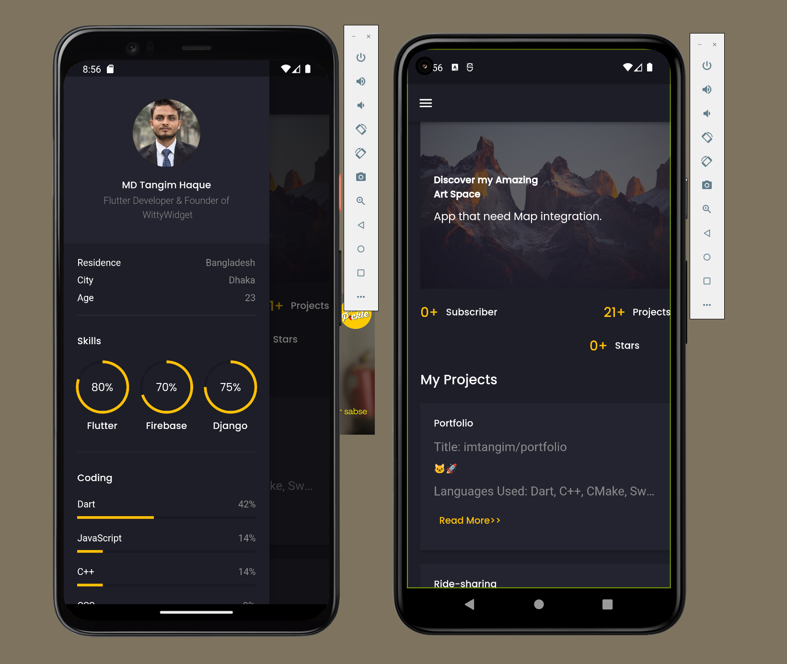

<h1 align="center" id="title">Chature - A simple Text Base app</h1>

<h2>Project Screenshots:</h2>

  

<h2>🚀 Demo</h2>

[Watch the Video](https://youtu.be/vuGF1sW_yiI)

<h2>🧐 Features</h2>

Here're some of the project's best features:

- Firebase Authetication
- Firebase Firestore

<h2>💻 Built with</h2>

Technologies used in the project:

- Firebase
- Firestore
- Flutter

<h2>💖Like my work?</h2>

Contact with me
https://t.me/tangim4103

